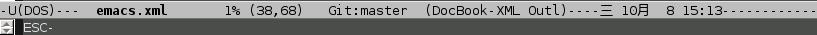

## 基础知识

引起我们痛苦的东西我们就会去爱它，以使自己觉得这份痛苦是值得的

Emacs
是一个架构在编辑器上的集成环境，除了最基本的编辑功能，还可以完成文件管理、终端模拟、浏览网页、收发邮件、编译程序等工作。

Emacs 使用 Elisp 语言进行配置和扩展，它本身也可以作为 Elisp 解释器使用。

Emacs 的界面主要由三部分构成：信息栏、回显区(echo)、缓冲区(buffer)

### 缓冲区

缓冲区(buffer) 类似于常规编辑器的文字编辑区。Emacs
并不直接对文件进行修改，而是读取文件的内容并显示在缓冲区中，在收到保存的指令后才将修改写入文件。

缓冲区名称通常为它所读取文件的文件名。

### 信息栏

在缓冲区之下为状态栏，像这样的



简单说明一下：

```shell
-U(UNIX)**-  emacs.xml      15% (28,32)  Git:master (DocBook-XML Outl)----二  9月 30 11:57--------------------
```

|                                           |                                            |
|:------------------------------------------|:-------------------------------------------|
| [](#emacs11)   | 点击拖动这里可以状态栏位置                 |
| [](#emacs12)   | 文件编码 U 代表 UTF-8； c 代表 chinese-gbk |
| [](#emacs13)   | 换行符类型 有 UNIX、DOS 和 MacOS 三种      |
| [](#emacs14)   | 文件状态 %代表只读 -代表可写 \*代表未保存  |
| [](#emacs22)   | 当前工作路径                               |
| [](#emacs15)   | 当前编辑的文件                             |
| [](#emacs16)   | 光标在当前文件中的位置                     |
| [](#emacs17)   | 光标所在的行、列                           |
| [](#emacs18)   | 版本控制系统                               |
| [](#emacs19) | 主模式                                     |
| [](#emacs20) | 辅模式                                     |
| [](#emacs21) | 日期时间                                   |

标题栏也可以显示一部分信息，并且可以自由定义。

``` synopsis
```

### 按键描述

Emacs 的功能键，通常为组合键。例如

**表 25.1. Emacs 按键描述**

| Emacs 描述 | 实际热键 | 功能         |
|------------|----------|--------------|
| C-f        | Ctrl+f   | 光标前进一格 |
| C-b        | Ctrl+b   | 光标后退一格 |
| C-d        | Ctrl+d   | 删除一个字符 |
| C-a        | Ctrl+a   | 回到行首     |

Emacs 对按键的描述方式中， *-*
之前的一个字符为修饰键，表示按住该键，再按 *-* 后面的键。

例如： **`C-a`** 表示按住 Ctrl 再按 a 键。 Emacs
对其它一些特殊按键的描述

|              |                                               |
|--------------|-----------------------------------------------|
| **`C-`**     | 按住 Ctrl键                                   |
| **`M-`**     | 按住 Meta键。在 PC 上，Meta键 通常对应 Alt 键 |
| **`C-M-`**   | 同时按住 Ctrl键 和 Meta键                     |
| **`S-`**     | Shift键                                       |
| **`s-`**     | Linux 下对应 WIN 键                           |
| **`RET`**    | 回车键                                        |
| **`TAB`**    | Tab键                                         |
| **`ESC`**    | Esc键                                         |
| **`SPC`**    | 空格键                                        |
| **`DEL`**    | 退格键                                        |
| **`Delete`** | 删除键                                        |

[TABLE]

在后面的部分中，将统一使用 Emacs 对按键的描述方式。

Emacs 十分强大，上面的组合键，远不能涵盖 Emacs
的功能于万一。除基本的编辑功能键外，其它功能多使用 *按键序列*：
连续的按下多组快捷键

例如： **`C-x C-c`** 表示先按下 **`C-x`** ，再按下 **`C-c`** 。也就是
**`Ctrl+x`** 后，再 **`Ctrl+c`** (退出 Emacs)

接下来 **`C-h t`** ，进入 《Emacs 快捷指南》

### 回显区

**`C-x h`** （先按 Ctrl+x 再按 h)
后，您会发现状态栏和编辑器底部之间的区域出现 Mark set
字样。同时，整个缓冲区的内容都被选中。

它是一个迷你缓冲区(minibuffer)，叫作回显区(echo
area)，提示您正在进行的操作，比如 Mark set(设定标记)

如果一个按键序列没有完成，却停止了输入。大约两秒后，回显区会显示已输入部分，以免您忘记。不要以为是
Emacs 反应迟钝
