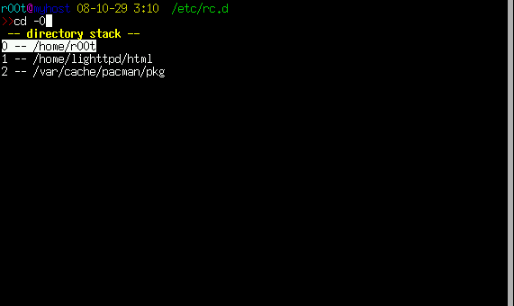

## Zsh 简介

zsh: The last shell you’ll ever need!

Z 是最后一个字母，所以它是终极 Shell。

zsh 拥有很多非常实用的功能

### 提示符

Zsh
的命令提示符令人印象深刻。它支持右侧对齐的提示符，并且可以配置成这个样子的：


### 自动补全

Zsh
的自动补全功能十分强大，可以根据上下文补全命令、选项、文件名、进程、用户名、变量、权限符等。不需要记忆繁多的快捷键，只要按
**`Tab`** 就可以了。


### 路径别名

Zsh 拥有贴心的路径别名。假设有一个很长的路径，例如
`/home/lighttpd/html`，可以把这个路径命名为 `~WWW`。


也可以使用 **cd** 历史纪录，**`cd -(TAB)`**



### 后缀别名

zsh 还可以设定后缀别名

```shell
#alias 默认为命令别名
alias ls='ls -F --color=auto'
#使用选项 -s 定义后缀别名，键入扩展名为“xml”的文件名，自动使用 emacs 打开
alias -s xml=emacs    
```

### 键绑定

Zsh 默认使用 Emacs风格 的键绑定，习惯 Bash 键绑定的朋友无需重新适应。Zsh
兼容大多数主流 Shell，像 Bash、Csh 等。

### 错误校正

Zsh 还拥有错误校正的功能


-- directory -- 是补全类型提示

/etc/x11 \[tab\] 后被修正为 /etc/X11 ，补全类型提示变成了 -- corrections
--


这个功能不是单纯的修正大小写，而是各种拼写错误。
比如说上面的例子，如果输入的是 11 或者 s11，它一样会修正为 X11

有一个前提，就是每次修正，只允许有一处字符错误。
两个以上的错误，除非可以匹配其它的选项，否则就不能修正， 12 就不能修正为
X11 ，除非候选里有 X12、Y12、Z12……

在配置文件里找到这一行，修改容错字数

```shell
zstyle ':completion:*:approximate:*' max-errors 1 numeric       
```
