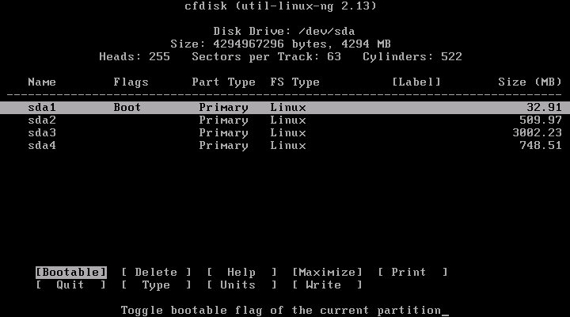
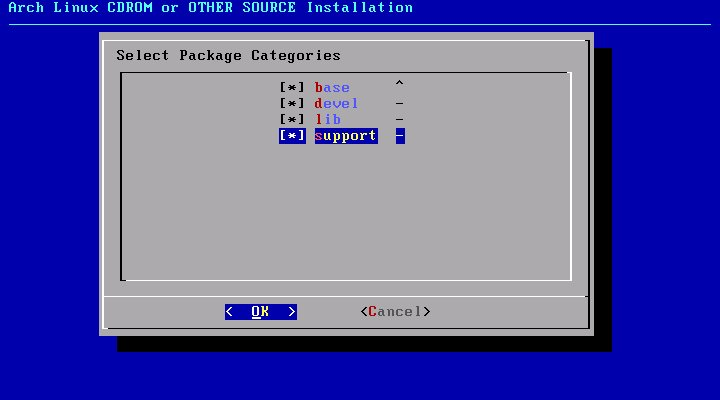
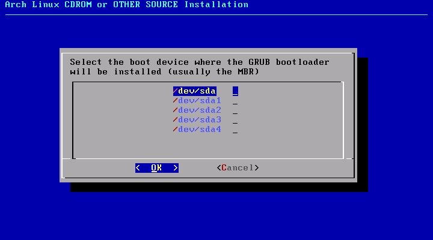
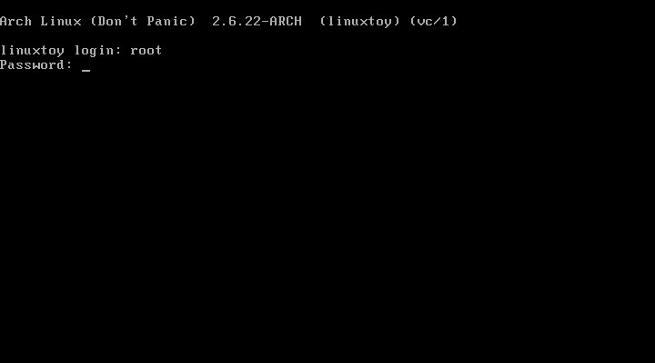

## 安装基本系统

大致上，安装 Linux 分为几个阶段：

前期准备  
通过各种方式获取安装介质，进入安装作业平台。比如下载 ISO
映像刻录光盘，使用光盘引导，启动安装程序

选择安装源  
选择通过安装介质安装还是通过网络下载的方式进行安装。如果通过网络安装，可能需要配置网络

准备磁盘  
操作系统最终是安装在磁盘上的，所以要分割磁盘、格式化分区、挂载

选择、安装软件包  
选择需要的软件。有些发行版如 Ubuntu LiveCD 安装时不能选择软件

配置系统  
对系统进行各种配置，使其能良好运行

安装引导程序  
以便启动时可以引导系统

新建用户  
使用 root 用户进行操作存在一定风险，尽量建立一个用于日常操作的用户

### 前期准备

首先下载 [Archlinux](http://www.archlinux.org/download/) 安装介质。

有两种安装介质： ISO 和 USB ，其中 ISO 为光盘映像，用来刻录安装光盘；
USB 为磁盘映像，可以恢复到 USB 移动存储设备

每种安装介质包含两种目标架构： i686 和 x86_64 ，其中 i686 适用于 奔腾Ⅱ™
以上级别 CPU ； x86_64 只适用于 64 位 CPU

每种目标架构又包含两个版本： CORE 和 FTP Install ，其中 FTP Install
只包含作业平台，需要通过网络下载软件包；CORE
除了作业平台，还包含基本系统^(\[[75](#ftn.id3148702)\])

假设您下载了 archlinux-2008.06-core-i686.iso
，刻录并使用它引导，您会看到以下界面


Archlinux
提供几种不同的引导选项，你可根据自己需要选择。一般情况下，按回车即可。

稍等片刻，Archlinux 引导进入这个画面


该画面包括一些有用的安装信息，如安装日志的记录、文档的查看、键盘映射的更改等。我们直接在命令提示符后输入下列指令，启动
Archlinux 安装程序：

```shell
/arch/setup  
```

### 作业平台

`/arch/setup` 是在安装介质中 FreeBSD 风格的安装脚本，安装 Archlinux
，其实就是进入作业平台后，运行这个脚本。

使用 Archlinux 安装光盘引导，就是进入作业平台的过程。作业平台通常包含：

内核  
作业平台需要可以使用其它工具，正在运行着的系统是起码的条件，这就需要有内核

磁盘工具  
将系统安装到磁盘上，必然要对分区进行相关操作

网络工具  
现代 Linux 系统大都支持通过网络安装，各种网络工具也是必需的

包管理系统  
在安装过程中，如果希望选择软件，通常需要包管理系统

否则就只能将预先打包的整个系统一古脑的恢复到机器上，且不能选择软件，如
Ubuntu LiveCD

编译工具链  
如果采用编译的方式安装，则需要编译工具链，如 Gentoo LFS

基本工具集  
以上组件可能会依赖其它的工具，而且安装光盘通常也被当作系统维护光盘，所以基本工具集是必需的

`/arch/setup` 脚本(安装程序)将在“字符图形”界面中调用上述工具:

### 选择安装源


如果使用已包含基本系统软件包的 CORE ，使用默认选项即可；如果通过
FTP/HTTP 下载软件包安装，可以选择第二项，安装程序会自动调用网络工具。

### 分割磁盘

接下来进入 Archlinux 安装主菜单。


现在需要准备硬盘，即对硬盘分区和挂载文件系统，相关基础概念请参阅
[“分区概念”一节](ch08.md#partition "分区概念")


- 自动分区(强烈不推荐)
- 对硬盘分区
- 设置挂载点
- 返回主菜单

安装程序会自动检测硬盘类型及容量，要求你选择硬盘，并调用硬盘分区程序
cfdisk


- 通过“上下方向键”选择分区，“左右方向键”、“TAB”或“首字母大写”切换操作选项
- New 创建分区，需要在 “Free Space”上操作
- Bootable 设置可引导标志
- Write 将分区方案写入分区表

推荐为以下目录建立分区：

/  
根目录。系统将安装在这里，通常 5～10G 足够

/home  
用户家目录。用户的所有文件都在这里，尽可能的大

swap  
交换分区。物理内存的1～2 倍(如果内存足够大，也可以不建立此分区)

建立好分区后，将根目录所在的分区设置为
Bootable^(\[[76](#ftn.id3149049)\])



准备妥当后，按下 **`W`** 写入分区表，**`Q`** 退出

### 挂载分区

分割磁盘后，选择 DONE 返回准备硬盘菜单。接着，我们选择 Set Filesystem
Mountpoints 来将分区挂载到文件系统上。


首先要求你挂载 swap ，我们选择 /dev/sda2。然后依次挂载 / 和 /home
目录。与挂载 swap
区不同的是，挂载后几个分区会要求你选择文件系统类型，推荐选择
XFS^(\[[77](#ftn.id3149110)\])。另外，挂载 /home
时，需要自己输入挂载点，按原名输入即可。


完成后，返回安装程序主菜单。

### 选择软件

接下来选择要安装的软件包。Archlinux 首先会要求选择安装介质，因为我们是从
CD-ROM 进行安装，所以保持默认。然后，我们选择 CD
驱动器，仍然默认。最后，选择软件包

软件包有四大类：



base  
最基本的包

devel  
包含一些软件编译工具

lib  
包含应用程序所需的库文件

support  
包含一些在网络和文件系统方面有用的包

使用空格键 标记/取消标记。当 Archlinux
安装程序提示你是否默认选中所有的包时，按 Yes
后会进入已标记分类包含软件的选择菜单，完成后按 OK 确认。


在开始安装前，安装程序将提示你是否保存 Pacman 缓存的软件包，我们选择
No。安装将调用 Pacman 安装你所选择的包，这个过程需要花一会时间。

### 配置系统

现在，我们将进入 Archlinux
安装过程中的一个重要环节，配置系统文件。Archlinux
安装程序先会询问是否使用 hwdetect，按推荐选择 Yes，并回答是否需要支持从
usb、firewire、pcmcia 等设备引导。

之后，我们需要选择文本编辑器，可选 nano 和
vim，选择后者。然后，我们就到了如下的配置画面：


配置的过程就是调用 Vim^(\[[78](#ftn.id3149284)\])
编辑器编辑以上配置文件。其中，需要重点关注的配置文件是：

#### /etc/rc.conf

/etc/rc.conf 是 Archlinux 最重要的配置文件。下面的选项有必要设置一下：

[TABLE]

#### /etc/locale.gen

这个文件包含系统所支持的区域及字符集。对中文用户来说，你需要去掉包括
zh_CN 这几行行首的注释符 **`#`**


#### /etc/fstab

该文件确定文件系统设置及挂载点，可以不用编辑，不过查看一下是否正确还是有必要的。


#### 设置 root 密码

为 root 帐号设置一个密码，需要重复输入确认。

#### 设置 Pacman 仓库镜像

为 Pacman 包管理系统设置仓库镜像，选择一个较快的地址。

### 安装引导程序

系统配置完成后，回到主菜单。进入下一步，安装系统引导程序。我们选择 GRUB
。此时，安装程序让你查看 /boot/grub/menu.lst
的内容。接着，要求选择安装的位置，我们选 MBR，主引导记录




### 退出安装

如果一切顺利，你已经完成了 Archlinux
的安装。现在是时候退出了。按提示我们在命令行输入下列指令，以便重启系统：

```shell
reboot    
```

### 新建用户


重启系统后，输入 root 帐号和密码登录系统。



第一件事，建立一个普通的帐号。可以通过以下命令完成：

```shell
useradd -m -s /bin/bash kardinal    
```

这将添加一个名为 kardinal 的用户。接着，为该账号设置密码：

```shell
passwd kardinal    
```

使用 **visudo** 命令将该账号加入 sudoers 列表

确认无误后，可以锁定 root 账号，以绝后患

```shell
su kardinal      #切换到普通账号，如果能够锁定，说明这个账号是 sudoers
sudo usermod -L root    
```

至此，Archlinux 基本系统安装完成

---

^(\[[75](#id3148702)\]) 将 CORE 中的软件包移除，差不多就是 FTP Install

^(\[[76](#id3149049)\]) 如果为 `/boot`
目录准备了独立的分区，则要将该分区设置为 Bootable

^(\[[77](#id3149110)\]) 大多数 Linux 系统中的引导程序 grub，不支持从 XFS
分区启动，解决的办法是将 `/boot` 目录挂载到一个独立的 ext2 分区……不过
Archlinux 中的 grub 不存在这个问题

传说 ext4 文件系统也十分优秀，不过大多数发行版还没有正式支持

^(\[[78](#id3149284)\]) 参阅[第 24 章 *Vim
编辑器*](ch24.md "第 24 章 Vim 编辑器")
