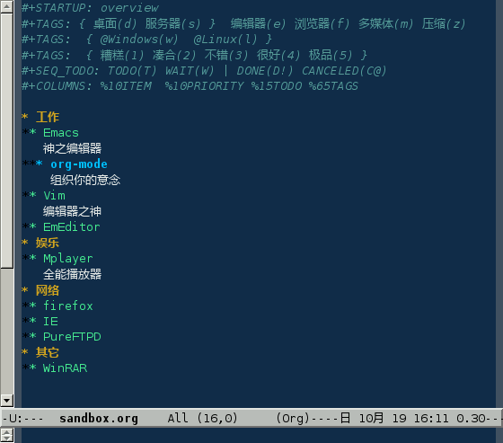
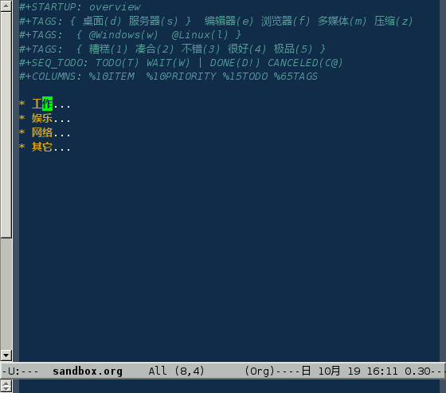
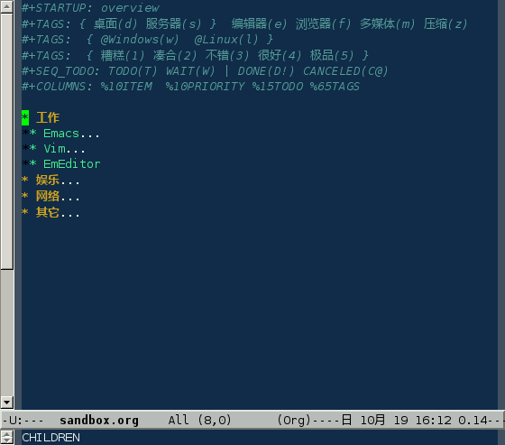

### 简介

Org-mode 主要包含标签、待办、日程表几大部分

**规模效应. **
如果资料只有几十几百条，借助分类的方式可以有效管理，但是资料的条目超过了一定的数量，标签更管用。好比传统的邮箱，使用分类的方式管理邮件；而
Gmail 由于起点容量很大，所以提供了标签

**组织. ** 提供了标签进行宏观控制，别外还有日程表作为快速通道

**构思与发布. ** Org-mode 不但可以整理思路，而且拥有比较完善的发布功能

### 配置

首先对 Org-mode 进行一些简单的配置，在 `.emacs` 文件中写入：

```shell
(setq org-hide-leading-stars t) 
 (define-key global-map "\C-ca" 'org-agenda) 
 (setq org-log-done 'time)  
```

|                                        |                                                 |
|:---------------------------------------|:------------------------------------------------|
| [](#org-01) | 只高亮显示最后一个代表层级的 **\***             |
| [](#org-02) | **`C-c a`** 进入日程表                          |
| [](#org-03) | 给已完成事项打上时间戳。可选 **note**，附加注释 |

### 建立一个 org 文件

新建一个名为 `sandbox.org`
的文件^(\[[82](#ftn.id3155679)\])，头部内容如下：

```shell
#+STARTUP: overview 
#+TAGS: { 桌面(d) 服务器(s) }  编辑器(e) 浏览器(f) 多媒体(m) 压缩(z)
#+TAGS:  { @Windows(w)  @Linux(l) }  
#+TAGS:  { 糟糕(1) 凑合(2) 不错(3) 很好(4) 极品(5) } 
#+SEQ_TODO: TODO(T) WAIT(W) | DONE(D!) CANCELED(C@) 
#+COLUMNS: %10ITEM  %10PRIORITY %15TODO %65TAGS     
```

|                             |                                                                   |
|:---------------------------:|:------------------------------------------------------------------|
| ![\[提示\]](images/tip.png) | 提示                                                              |
|                             | 这里的内容可以随时更改，但是要记得在改后用 **`C-c C-c`** 刷新设置 |

|                                        |                                                                                    |
|:---------------------------------------|:--------------|
| [](#org-11) | 启动时概览                                                                         |
| [](#org-12) | 设定标签，括弧中的为标签快捷键（如果没有指定，默认为首字母）。可以设置在多行中     |
| [](#org-15) | 花括号为标签组，组中的标签只能选一个                                               |
| [](#org-13) | 设定待办状态。将项设置为 **`|`** 后面的状态时（DONE CANCELED），会打上 CLOSED 标志 |
| [](#org-14) | 设定列视图                                                                         |

### 大纲

在这个新建的文件中插入下面内容：

```shell
* 工作
** Emacs
   神之编辑器
*** org-mode
    组织你的意念
** Vim
   编辑器之神
** EmEditor
* 娱乐
** Mplayer
   全能播放器
* 网络
** firefox
** IE
** PureFTPD
* 其它
** WinRAR   
```

- **`*`** 之后有一个空格，一定不能省略
- 每一个 **`*`** 代表一级分支，**`***`** 就代表第三级分支

现在你的 Emacs 应该显示这样的内容



其实这就是一个大纲模式，只是 Org-mode
用更醒目的色彩来显示，并且快捷键方便一些

按下 **`S-TAB`**，会显示概览：



把光标定位在 **`* 工作`** 这一行，按几下 TAB



|                             |                                                                                                       |
|:---------------------------:|:---------------------------------|
| ![\[提示\]](images/tip.png) | 提示                                                                                                  |
|                             | 连续按下 **`TAB`** 键，会在显示分支、全部显示、全部隐藏几种状态间循环切换，**`S-TAB`** 作用于全部分支 |

以下快捷键控制 Org-mode 显示

|           |                              |
|-----------|------------------------------|
| C-c C-a   | 全部显示                     |
| C-c C-x b | 在一个新缓冲区中显示当前分支 |

当一个 `org` 文件内容很多时，使用 Emacs
的快捷键移动就很没有效率，可以使用 Org-mode 内建的移动键

|        | 向前    | 向后    |
|--------|---------|---------|
| 同级   | C-c C-f | C-c C-b |
| 跨级   | C-c C-n | C-c C-p |
| 上一级 | C-c C-u |         |
| 跳转   | C-c C-j |         |

对分支结构进行修改：

|             |                    |
|-------------|--------------------|
| C-RET       | 加入新的同级标识   |
| M-left      | 将当前项提升一级   |
| M-right     | 将当前项降低一级   |
| M-S-left    | 将当前分支提升一级 |
| M-S-right   | 将当前分支降低一级 |
| M-S-up      | 将当前分支向上移动 |
| M-S-down    | 将当前分支向下移动 |
| C-c C-x C-k | 删除当前分支       |
| C-c C-x M-w | 复制当前分支       |
| C-c C-x C-y | 粘贴分支           |
| C-c C-w     | 移动当前分支       |
| C-c \*      | 为当前分支加入内容 |

### 内容

可以在项标题下随意的插入内容。通过下面方式插入链接：

```shell
[[链接地址][链接名称]]    
```

如果不想定义链接的名称，可以这样：

```shell
[[链接地址]]    
```

如果想修改这个链接，在链接后按下 **`backspace`**

---

^(\[[82](#id3155679)\]) Emacs 打开扩展名为 `.org` 的文件时自动进入
Org-mode
