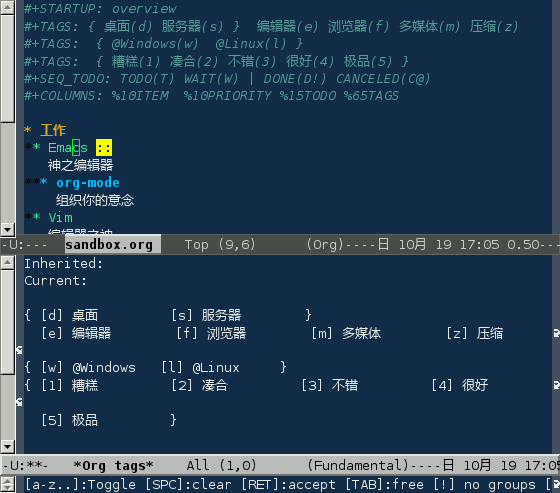
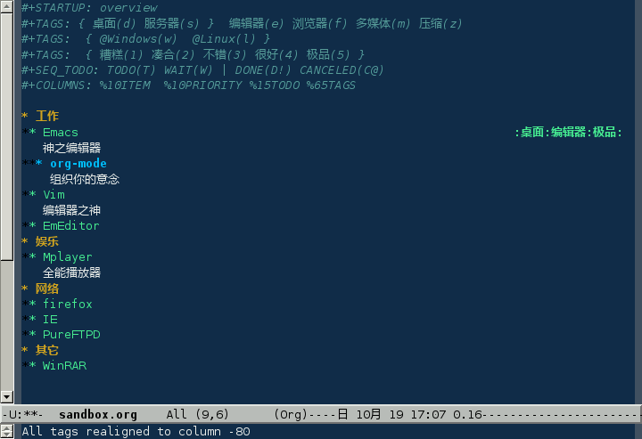
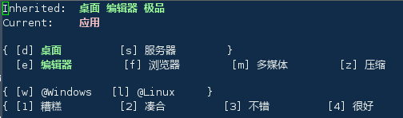

## 标签

### 使用

对于信息的管理，有分类和标签两种方式。

分类的方式，每一个项只能属于一个分类，但是分类的方法往往不只一种，比如一个软件，从类型上分，可以有编辑器、浏览器等，从评价上分，可以是好、坏；如果使用类型来分类，就不能使用评价来分类；而标签的方式可以很好的解决这个问题

将光标定位在当前项（Emacs）上，按下 **`C-c C-c`**



- 注意回显区中的内容：\[a-z\]用快捷键选取 \[SPC\]清除所有标签
  \[RET\]确认 \[TAB\]自由输入（不建议）
  \[!\]取消组（同一组签标可以多选） \[C-c\]单选多选切换

使用快捷键 **`s`** 选中“服务器”，然后再按 **`d`**
选中桌面，可以看到，两个不能同时选，因为它们是一组标签，只能选一个。再分别按下
**`e`** 和 **`5`**,回车确认：



接下来在 **`*** org-mode`** 上 **`C-c C-c`**



可以看到，它自动继承了“桌面”、“编辑器”、“极品”三个标签，而它自己拥有“应用”这个标签

### 定义

在当前文件头部进行定义：

```shell
#+TAGS: { 桌面(d) 服务器(s) }  编辑器(e) 浏览器(f) 多媒体(m) 压缩(z)    
```

每项之间必须用空格分隔，可以在括弧里定义一个快捷键；花括号里的为标签组，只能选择一个

对标签定义进行修改后，要在文件头部按下 **`C-c C-c`**
刷新^(\[[83](#ftn.id3156348)\])

也可以在 Emacs 配置文件 `.emacs` 中进行定义

```shell
(setq org-tag-alist '(("编辑器" . ?e) ("浏览器" . ?f) ("多媒体" . ?m)))    
```

在配置文件中设置的是全局标签，只要是
org-mode，无论是否在头部进行设置，都可以使用这些标签。不推荐这种方式

### 查询

设置标签的主要目的还是为了查询。org-mode 会为搜索结果建立一个视图

|            |                    |
|------------|--------------------|
| C-c \\     | 搜索标签           |
| C-c / T    |                    |
| C-u C-c \\ | 搜索带 TODO 的标签 |

可以使用逻辑表达式限制条件，更准确灵活的搜索

|     |      |      |                              |
|-----|------|------|------------------------------|
| \+  | 和   | a+b  | 同时有这两个标签             |
| \-  | 排除 | a-b  | 有 a 但没有 b                |
| \|  | 或   | a\|b | 有 a 或者有 b                |
| &   | 和   | a&b  | 同时有 a 和 b，可以用“+”替代 |

在查询视图中 **`C-c C-c`** 退出

---

^(\[[83](#id3156348)\]) 在文件头部按下 **`C-c C-c`**
为刷新设置；在项标题按下 **`C-c C-c`** 为设置标签
