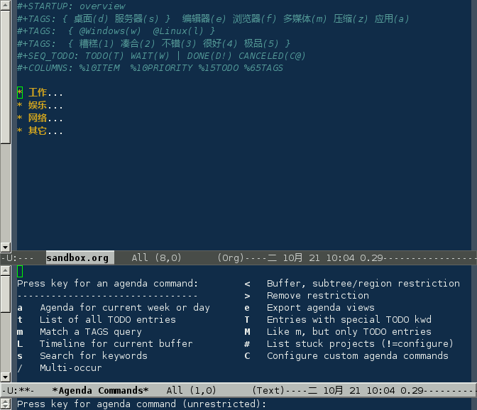

## 事件

事件默认有两种状态“TODO”、“DONE”，在项标题上 **`C-c C-t`**
切换事件状态；**`M-S-RET`** 新建事件

### 定义

在文件头部定义事件状态：

```shell
#+SEQ_TODO: TODO | DONE  CANCELED
#+SEQ_TODO: TODO(T) | DONE(D)  CANCELED(C) 
#+SEQ_TODO: TODO(T!) | DONE(D@)  CANCELED(C@/!)    
```

|                                        |                                                                |
|:---------------------------------------|:---------------------------------------------------------------|
| [](#org-21) | **`|`** 分隔完成与未完成两种状态，完成状态会打上 CLOSED 时间戳 |
| [](#org-22) | 设定快捷键                                                     |
| [](#org-23) | **`!`** 打上时间戳；**`@`** 要求说明                           |

也可以在配置文件中设置全局事件状态：

```shell
     (setq org-todo-keywords
           '((sequence "TODO" "|" "DONE"  "CANCELED")
             (sequence "REPORT" "BUG" "KNOWNCAUSE" "|" "FIXED")
             ))    
```

### 操作

|             |                                                  |
|-------------|--------------------------------------------------|
| C-u C-c C-t | 手动输入 TODO 状态，如果设定快捷则使用快捷键输入 |
| S-right     | 循环切换 TODO 状态，两个以上 TODO 状态时使用     |
| S-left      |                                                  |
| C-S-right   | 组间切换                                         |
| C-S-left    |                                                  |
| C-c C-v     | 查询视图                                         |
| C-c / t     |                                                  |
| C-c a t     | 全局 TODO 列表                                   |

### 日程表

在 Emacs 配置文件 `.emacs` 定义日程表快捷键：

```shell
(define-key global-map "\C-ca" 'org-agenda)    
```

**`C-c [`** 将当前文件加入日程表，**`C-c a`**



|     |                          |
|-----|--------------------------|
| a   | 本周事件                 |
| t   | 显示所有事件             |
| m   | 查询标签                 |
| L   | 当前缓冲区时间线         |
| s   | 查询关键词               |
| T   | 查询带 TODO 关键词的项   |
| M   | 查询带 TODO 关键词的标签 |
| \#  | 显示已停止事件           |
| q   | 退出日程表               |

可以将多个 org 文件从日程表加入、移除，或者将日程表锁定在当前 org
文件的某个分支：

|            |                                              |
|------------|----------------------------------------------|
| C-c \[     | 将当前文件加入日程表。如果已加入，移动到前面 |
| C-c \]     | 将当前文件从日程表中移除                     |
| C-c C-x \< | 锁定到当前树(只显示当前树的事件)             |
| C-c C-x \> | 解除锁定                                     |

### 优先级

事件有“A”、“b”、“C”三种优先级别，使用 **`C-c ,`** 手动设定级；使用
**`S-up`** 和 **`S-down`** 进行调整

### 进度

可以给事件设定进度，使用类似 **`[66%]`** 或者 **`[2/3]`** 这样的形式
