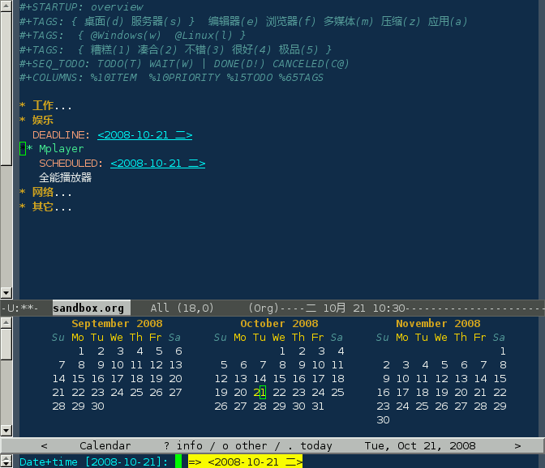
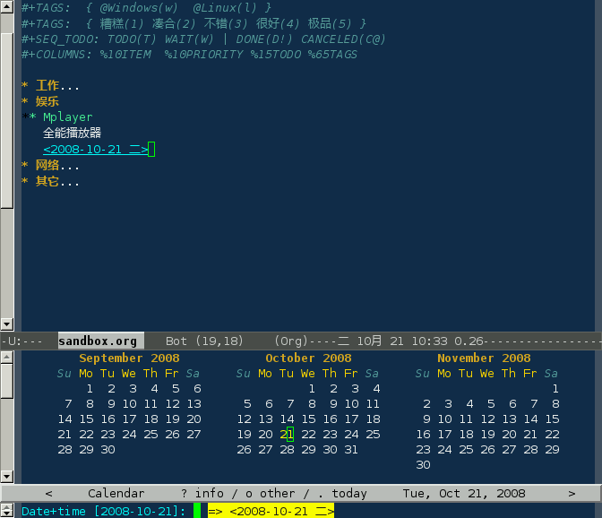
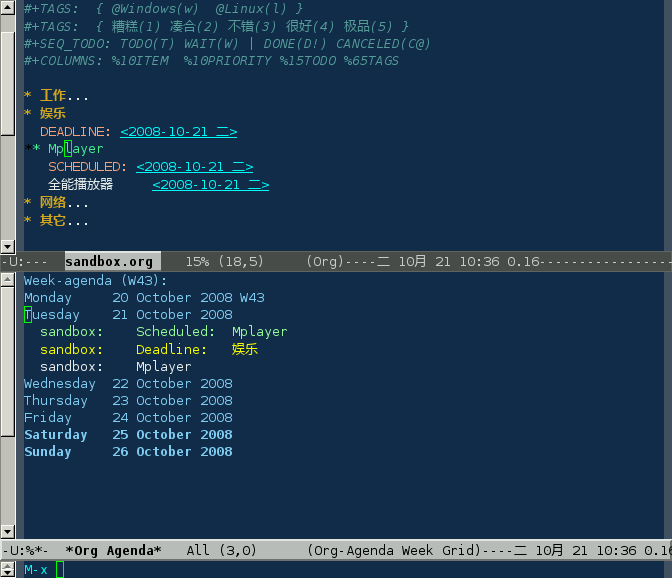

## 时间

**`C-c C-d`** 设定截止日期(DEADLINE)；**`C-c C-s`**
设定计划(SCHEDULED)：

**`C-c .`**在当前位置插入一个时间戳：

时间标记都会显示在日程表的本周事件中:

|                 |                                                                                  |
|-----------------|-------------|
| C-c .           | 插入时间戳；如果连续插入两个时间戳，则插入一个时间范围                           |
| C-u C-c .       | 更加精确的时间戳，在日程表中以时间线显示                                         |
| C-c !           | 插入时间戳，不在日程表中显示                                                     |
| C-c \<          | 直接插入时间戳（当前日期）                                                       |
| C-c \>          | 查看日历                                                                         |
| C-c C-o         | 访问当前时间戳的日程表                                                           |
| S-left\|S-right | 以天为单位调整时间戳时间                                                         |
| S-up\|S-down    | 调整光标所在时间单位；如果光标在时间戳之外，调整时间戳类型（是否在日程表中显示） |
| C-c C-y         | 计算时间范围长度                                                                 |
