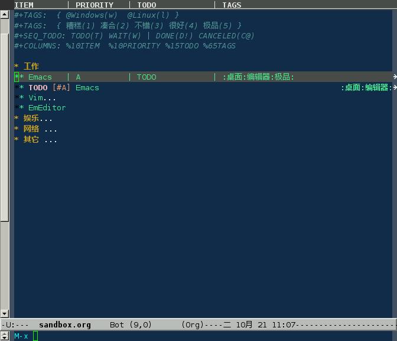

## 列视图

**`C-c C-x C-c`** 进入列视图；按 **`q`** 退出：



在文件头部设置列：

```shell
#+COLUMNS: %10ITEM  %10PRIORITY %15TODO %65TAGS   
```

|                                        |                        |
|:---------------------------------------|:-----------------------|
| [](#org-31) | 百分数表示该列所占宽度 |
| [](#org-32) | 优先级                 |
| [](#org-33) | 事件状态               |
| [](#org-34) | 标签                   |

|                 |                |
|-----------------|----------------|
| C-c C-x C-c     | 进入列视图     |
| r\|g            | 刷新           |
| q               | 退出           |
| left\|right     | 在列间移动     |
| S-left\|S-right | 改变当前列的值 |
| n\|p            |                |
| 1~9,0           | 用编号选择值   |
| v               | 查看当前值     |
