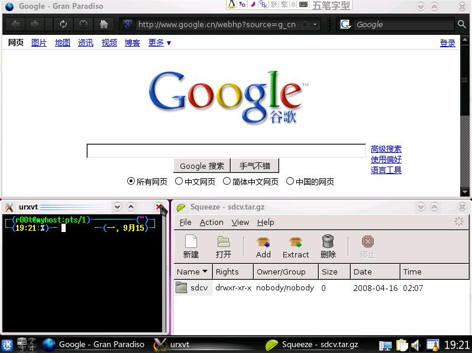
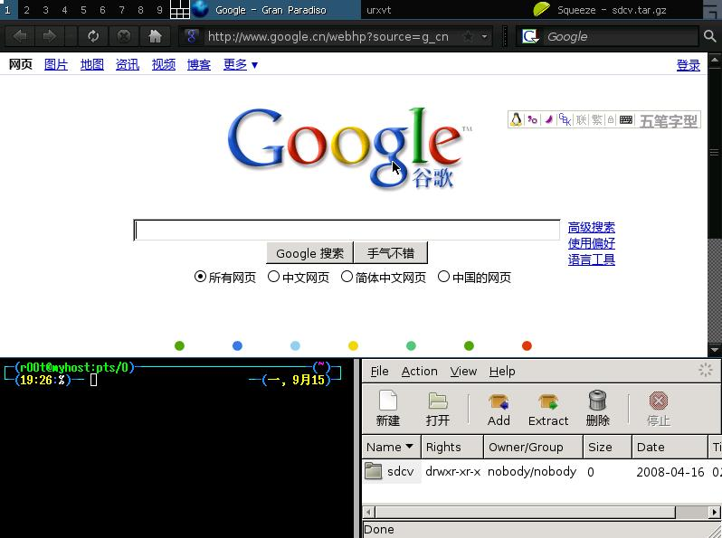
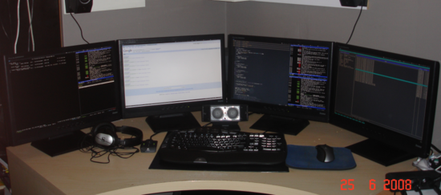

## Tiling window manager

**`Tiling window manager`**，直译为“瓦片窗口管理器”^(\[[84](#ftn.id3158868)\])，意译为“平铺式窗口管理器”。

假设你需要同时监视多个程序的状态并进行操作，你就需要不停的按Alt+Tab切换，但是这会加速
Alt 尤其是 Tab 的磨损^(\[[85](#ftn.id3158880)\])。

无奈之下，你可能会这样作：

用鼠标拖放成这样，绝对不是一件愉快的事，而且各个窗口的大小可能不太合适，窗口之间可能会有点缝隙，虽然不漏风，但是也影响注意力……

而在平铺式窗口管理器中，无论打开多少个窗口，都会把整个屏幕占满，不留一点儿缝隙(如果只有一个窗口，直接全屏)

窗口没有标题栏（标题在状态栏上），边框尽可能的窄（可设置为0），最大程度的节约了桌面空间，如果你的显示器比较大，或者有多个显示器，平铺式窗口管理器将是不二之选

常见的平铺式窗口管理器有：
awesome、xmonad、dwm、wmii、ion、ratpoison、larswm 等， 推荐使用
**`awesome`**

---

^(\[[84](#id3158868)\]) 像屋顶的瓦片一样平铺开来

^(\[[85](#id3158880)\]) 手的磨损忽略了，因为它是可再生的
