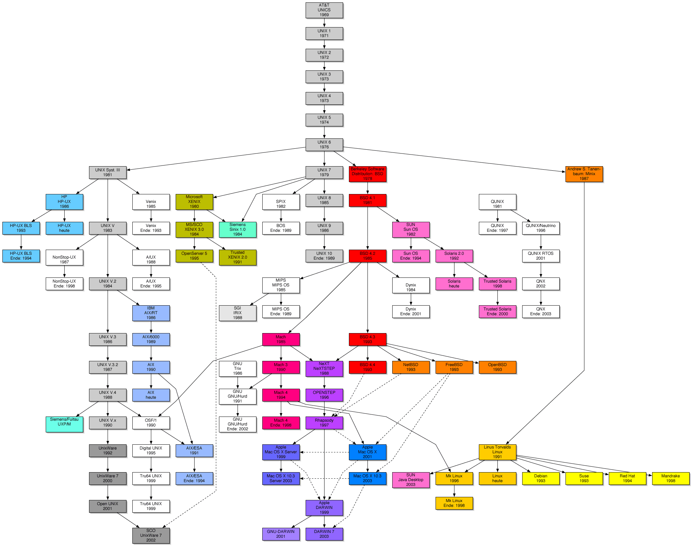

## UNIX家谱

UNIX的历史开始于1969年ken Thompson，Dennis
Ritchie（即著名的K&G，C语言的发明人）与一群人在一部PDP-7上进行的一些工作，后来这个系统变成了UNIX。它主要的几个版本为：

V1（1971）：第一版的UNIX，以PDP-11/20的汇编语言写成。包括文件系统，fork、roff、ed等软件。

V4（1973）：以C语言从头写过，这使得UNIX修改容易，可以在几个月内移植到新的硬件平台上。最初C语言是为UNIX设计的，所以C与UNIX间有紧密的关系。

V6（1975）：第一个在贝尔实验室外（尤其是大学中）广为流传的UNIX版本。这也是UNIX分支的起点与广受欢迎的开始。1.xBSD（PDP-II）就是由这个版本衍生出来的。

V7（1979）：在许多UNIX玩家的心目中，这是“最后一个真正的UNIX，”这个版本包括一个完整的K&R
C编译器，Bourne shell。V7移植到VAX机器后称为32V。

目前开发UNIX（System V）的公司是Unix System Laboratories
(USL)。USL本为AT&T所有，1993年初被Novell收购。Novell于1993年末将UNIX这个注册商标转让给X/Open组织。

目前为止，UNIX有两大流派：那就是AT&T发布的UNIX操作系统System
V与美国加州大学伯克利分校发布的UNIX版BSD（Berkeley Software
Distribution）。SVR4是两大流派融合后的产物。1991年底，与System
V针锋相对的开放软件基金会(Open Software Foundation)推出了OSF/1。

