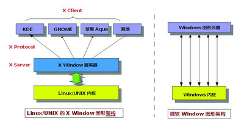

## X Window 打造桌面环境

在介绍KDE和Gnome之前，我们有必要先来介绍UNIX/Linux图形环境的概念。对一个习惯Windows的用户来说，要正确理解UNIX
/Linux的图形环境可能颇为困难，因为它与纯图形化Windows并没有多少共同点。Linux实际上是以UNIX为模板的，它继承了UNIX内核设计精简、高度健壮的特点，无论系统结构还是操作方式也都与UNIX无异。简单点说，你可以将Linux看成是UNIX类系统中的一个特殊版本。我们知道，微软Windows在早期只是一个基于DOS的应用程序，用户必须首先进入DOS后再启动Windows进程，而从Windows
95开始，微软将图形界面作为默认，命令行界面只有在需要的情况下才开启，后来的Windows98/Me实际上也都隶属于该体系。但在
Windows2000之后，DOS被彻底清除，Windows成为一个完全图形化的操作系统。但UNIX/Linux与之不同，强大的命令行界面始终是它们的基础，在上个世纪八十年代中期，图形界面风潮席卷操作系统业界，麻省理工学院（MIT）也在1984年与当时的DEC公司合作，致力于在UNIX系统上开发一个分散式的视窗环境，这便是大名鼎鼎的“X
Window System”项目。不过，X
Window（请注意不是XWindows）并不是一个直接的图形操作环境，而是作为图形环境与UNIX系统内核沟通的中间桥梁，任何厂商都可以在
XWindow基础上开发出不同的GUI图形环境。MIT和DEC的目的只在于为UNIX系统设计一套简单的图形框架，以使UNIX工作站的屏幕上可显示更多的命令，对于GUI的精美程度和易用程度并不讲究，毕竟那时候能够熟练操作UNIX的都是些习惯命令行的高手，根本不在乎GUI存在与否。1986
年，MIT正式发行X
Window，此后它便成为UNIX的标准视窗环境。紧接着，全力负责发展该项目的X协会成立，XWindow进入了新阶段。与此同步，许多UNIX厂商也在X
Window原型上开发适合自己的UNIXGUI视窗环境，其中比较著名的有SUN与AT&T联手开发的“Open
Look”、IBM主导下的OSF（Open
SoftwareFoundation，开放软件基金会）开发出的“Motif”。而一些爱好者则成立了非营利的XFree86组织，致力于在X86系统上开发XWindow，这套免费且功能完整的XWindow很快就进入了商用UNIX系统中，且被移植到多种硬件平台上，后来的Linux也直接从该项目中获益。当然，这些早期的XWindow环境都设计得很简单，许多GUI元素模仿于微软的Windows，但XWindow拥有一个小小的创新：当鼠标指针移动到某个窗口时，该窗口会被自动激活，用户无需点击便能够直接输入，简化了用户操作—这个特性在后来的KDE和Gnome中也都得到完整的继承。

由于必须以UNIX系统作为基础，XWindow注定只能成为UNIX上的一个应用，而不可能与操作系统内核高度整合，这就使得基于XWindow的图形环境不可能有很高的运行效率，但它的优点在于拥有很强的设计灵活性和可移植性。X
Window从逻辑上分为三层：最底层的XServer（X服务器）主要处理输入/输出信息并维护相关资源，它接受来自键盘、鼠标的操作并将它交给X
Client（X客户端）作出反馈，而由XClient传来的输出信息也由它来负责输出；最外层的XClient则提供一个完整的GUI界面，负责与用户的直接交互（KDE、Gnome都是一个X
Client），而衔接X Server与XClient的就是“X
Protocol(X通讯协议)”、它的任务是充当这两者的沟通管道。尽管UNIX厂商采用相同的XWindow，但由于终端的X
Client并不相同，这就导致不同UNIX产品搭配的GUI界面看起来非常不一样。

**图 49.1. X Window系统架构示意图**

