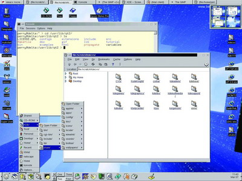
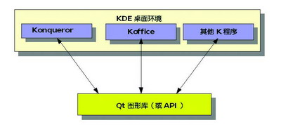

## KDE项目的发起

MIT的X
Window推出之后就成为UNIX图形界面的标准，但在商业应用上分为两大流派：一派是以Sun公司领导的OpenLook阵营，一派是IBM/HP领导的OSF(Open
SoftwareFoundation)的Motif，双方经过多年竞争之后，Motif最终获得领先地位。不过，Motif只是一个带有窗口管理器（Window-Manager）的图形界面库（Widget-Library），而非一个真正意义上的GUI界面。经过协商之后IBM/HP与SUN决定将Motif与Open
Look整合，并在此基础上开发出一个名为“CDE(Common Desktop
Environment)”的GUI作为UNIX的标准图形界面。遗憾的是，Motif/CDE和UNIX系统的价格都非常昂贵，而当时微软的
Windows发展速度惊人并率先在桌面市场占据垄断地位，CDE则一直停留在UNIX领域提供给root系统管理员使用，直到今天情况依然如此。

**图 49.2. KDE 1.0尽管设计粗糙，但它奠定了整个KDE项目的基础。**

在上个世纪九十年代中期，以开源模式推进的Linux在开发者中已经拥有广泛的影响力。尽管X
Window已经非常成熟，也有不少基于XWindow的图形界面程序，但它们不是未具备完整的图形操作功能就是价格高昂（如CDE），根本无法用于
Linux系统中。如果Linux要获得真正意义上的突破，一套完全免费、功能完善的GUI就非常必要。1996年10月，图形排版工具Lyx的开发者、一位名为MatthiasEttrich的德国人发起了KDE（Kool
Desktop
Environment）项目，与之前各种基于XWindow的图形程序不同的是，KDE并非针对系统管理员，它的用户群被锁定为普通的终端用户，MatthiasEttrich希望KDE能够包含用户日常应用所需要的所有应用程序组件，例如Web浏览器、电子邮件客户端、办公套件、图形图像处理软件等等，将UNIX/Linux彻底带到桌面。当然，KDE符合GPL规范，以免费和开放源代码的方式运行。

KDE项目发起后，迅速吸引了一大批高水平的自由软件开发者，这些开发者都希望KDE能够将Linux系统的强大能力与舒适直观的图形界面联结起来，创建最优秀的桌面操作系统。经过艰苦卓绝的共同努力，KDE
1.0终于在1998年的7月12日正式推出。以当时的水平来说，KDE1.0在技术上可圈可点，它较好的实现了预期的目标，各项功能初步具备，开发人员已经可以很好地使用它了。当然，对用户来说，KDE1.0远远比不上同时期的Windows
98来得平易近人，KDE
1.0中大量的Bug更是让人头疼。但对开发人员来说，KDE1.0的推出鼓舞人心，它证明了KDE项目开源协作的开发方式完全可行，开发者对未来充满信心。有必要提到的是，在KDE1.0版的开发过程中，SuSE、Caldera等Linux商业公司对该项目提供资金上的支持，在1999年，IBM、
Corel、RedHat、富士通-西门子等公司也纷纷对KDE项目提供资金和技术支持，自此KDE项目走上了快速发展阶段并长期保持着领先地位。但在
2004年之后，GNOME不仅开始在技术上超越前者，也获得更多商业公司的广泛支持，KDE丧失主导地位，其原因就在于KDE选择在Qt平台的基础上开发，而Qt在版权方面的限制让许多商业公司望而却步。

Qt是一个跨平台的C++图形用户界面库，它是挪威TrollTech公司的产品。基本上，Qt同XWindow上的
Motif、Open
Look、GTK等图形界面库和Windows平台上的MFC、OWL、VCL、ATL是同类型的东西，但Qt具有优良的跨平台特性（支持
Windows、Linux、各种UNIX、OS390和QNX等）、面向对象机制以及丰富的API，同时也可支持2D/3D渲染和OpenGLAPI。在当时的同类图形用户界面库产品中，Qt的功能最为强大，MatthiasEttrich在发起KDE项目时很自然选择了Qt作为开发基础，也正是得益于
Qt的完善性，KDE的开发进展颇为顺利，例如Netscape5.0在从Motif移植到Qt平台上仅仅花费了5天时间。这样，当KDE1.0正式发布时，外界看到的便是一个各项功能基本具备的GUI操作环境，且在后来的发展中，Qt/KDE一直都保持领先优势。有必要提到的是，TrollTech公司实质性参与了KDE项目，如前面提到Netscape
5.0的移植工作就是由TrollTech的程序员完成，而KDE工程的发起者、MatthiasEttrich本人也在1998年离开学术界加入
TrollTech，并一直担任该公司的软件开发部主管，因此TrollTech公司对于KDE项目拥有非常强的影响力（当然不能说绝对掌握，毕竟KDE
开发工作仍然是由自由程序员协作完成的）。我们前面提到，KDE采用GPL规范进行发行，但底层的基础Qt却是一个不遵循GPL的商业软件，这就给KDE
上了一道无形的枷锁并带来可能的法律风险。一大批自由程序员对KDE项目的决定深为不满，它们认为利用非自由软件开发违背了GPL的精神，于是这些GNU
的狂热信徒兵分两路：其中一部分人去制作Harmonny，试图重写出一套兼容Qt的替代品，这个项目虽然技术上相对简单，但却没有获得KDE项目的支持；另一路人马则决定重新开发一套名为“GNOME（GNU
Network
ObjectEnvironment）”的图形环境来替代KDE，一场因为思想分歧引发的GUI之战开始了。

**图 49.3. Qt是整个KDE的基础，它采用双重授权。**

