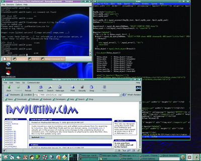
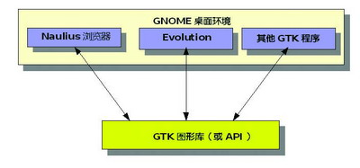

## GNOME与KDE交替发展

GNOME项目于1997年8月发起，创始人是当时年仅26岁的墨西哥程序员Miguel
DeIcaza。关于GNOME的名称有一个非常有趣的典故：Miguel到微软公司应聘时对它的ActiveX/COMmodel颇有兴趣，GNOME（Network
Object
Model）的名称便从此而来。GNOME选择完全遵循GPL的GTK图形界面库为基础，因此我们也一般将GNOME和KDE两大阵营称为
GNOME/GTK和KDE/Qt。与Qt基于C++语言不同，GTK采用较传统的C语言，虽然C语言不支持面向对象设计，看起来比较落后，但当时熟悉C
语言的开发者远远多于熟悉C++的开发者。加之GNOME/GTK完全遵循GPL版权公约，吸引了更多的自由程序员参与，但由于KDE先行一步，且基础占优势，一直都保持领先地位。1999年3月，GNOME
1.0在匆忙中推出，稳定性奇差无比，以至于许多人笑称GNOME 1.0还没有KDE
1.0Alpha稳定，而同期的KDE
1.1.2无论在稳定性还是功能上都远胜于GNOME，直到10月份推出的GNOME1.0.55版才较好解决了稳定性问题，给GNOME重新赢回声誉。由于思想分歧，当时GNOME的开发者与KDE的开发者在网络上吵得天翻地覆，几乎达到相互仇视的地步。但不管怎么说，GNOME都跌跌撞撞迈出了第一步，尽管那时KDE几乎是所有Linux发行版默认的桌面环境。

**图 49.4. KDE2.0拥有丰富的应用软件，实力明显超过GNOME**

GNOME的转机来自于商业公司的支持。当时Linux业界的老大RedHat很不喜欢KDE/Qt的版权，在GNOME项目发起后RedHat立刻对其提供支持。为了促进GNOME的成熟，RedHat甚至专门派出几位全职程序员参与GNOME的开发工作，并在1998年1月与GNOME项目成员携手成立了RedHat高级开发实验室。1999年4月，Miguel与另一名GNOME项目的核心成员共同成立HelixCode公司为GNOME提供商业支持，这家公司后来更名为Ximian，它事实上就成为GNOME项目的母公司，GNOME平台上的Evolution邮件套件便出自该公司之手。进入
2000年之后，一系列重大事件接连发生，首先，一批从苹果公司出来的工程师成立Eazel公司，为GNOME设计用户界面和Nautilus（鹦鹉螺）文件管理器。同年8月，GNOME基金会在Sun
、RedHat、Eazel、HelixCode（Ximian）的共同努力下正式成立，该基金会负责GNOME项目的开发管理以及提供资金，Miguel本人则担任基金会的总裁。此时，GNOME获得许多重量级商业公司的支持，如惠普公司采用GNOME作为HP-UX系统的用户环境，SUN则宣布将StarOffice套件与GNOME环境相整合，而GNOME也将选择OpenOffice.org作为办公套件，IBM公司则为
GNOME共享了SashXB极速开发环境。同时，GNOME基金会也决定采用Mozilla作为网页浏览器。KDE阵营也毫不示弱，在当年10月份推出万众瞩目的KDE
2.0。KDE2.0堪称当时最庞大的自由软件，除了KDE平台自身外，还包括Koffice办公套件、Kdevelop集成开发环境以及
Konqueror网页浏览器。尽管这些软件都还比较粗糙，但KDE
2.0已经很好实现了MatthiasEttrich成立KDE项目的目标。也是在这个月，TrollTech公司决定采用GPL公约来发行Qt的免费版本，希望能够以此赢得开发者的支持。这样，Qt实际上就拥有双重授权：如果对应的Linux发行版采用免费非商业性的方式进行发放，那么使用KDE无须向
TrollTech交纳授权费用；但如果Linux发行版为盈利性的商业软件，那么使用KDE时必须获得授权。由于TrollTech是商业公司且一直主导着KDE的方向，双许可方式不失为解决开源与盈利矛盾的好办法。TrollTech宣称，双许可制度彻底解决了KDE在GPL公约方面的问题，但
RedHat并不喜欢，RedHat不断对GNOME项目提供支持，希望它能够尽快走向成熟，除RedHat之外的其他Linux厂商暂时都站在KDE这一边，但他们同时也在发行版中捆绑了GNOME桌面。

在2001-2002年，火热一时的Linux运动开始陷入低潮期，几乎所有的厂商都发现桌面Linux版本不可能盈利，而易用性的不足也让业界不看好
Linux进入桌面的前途。但在服务器市场，Linux发展势头非常迅猛，直接对UNIX和WindowsServer造成威胁。不过，秉承自由软件理念的开发者们并不理会外界的论调，他们一直将Linux桌面化作为目标，GNOME项目和KDE项目都在这期间获得完善发展。2001年4
月，GNOME1.4发布，它修正了之前版本的Bug，功能也较为完善，但在各方面与KDE依然存在差距；同年8月，KDE发展到2.2版本。2002年
4月，KDE跳跃到3.0版本，它以Qt
3.0为基础，各项功能都颇为完备，具备卓越的使用价值；两个月后，GNOME阵营也推出2.0版本，它基于更完善的GTK2.0图形库。进入到2003
年后，KDE与GNOME进入真正意义上的技术较量。1月份，KDE
3.1推出，而GNOME2.4则在随后的2月份推出，两大平台都努力进行自我完善。也是在这一年，Linux商业界出现一系列重大的并购案：1月份，Novell公司宣布收购德国的SuSE
Linux，而SuSELinux是地位仅次于RedHat的全球第二大Linux商业企业；8月，Novell接着将GNOME的母公司Ximian收归旗下。这两起并购案让Novell成为实力与RedHat不相上下的强大Linux企业，而Novell和RedHat就成为能够影响Linux未来的两家企业。在图形环境上，SuSE一向选择KDE，并在KDE身上投入相当多的精力，在被Novell并购后，SuSE的桌面发行版尽管还侧重于KDE，但同样不喜欢Qt授权的Novell已经开始向GNOME迁移。

**图 49.5. GTK库是GNOME项目的基础，它完全采用GPL授权因此获得广泛支持。**

