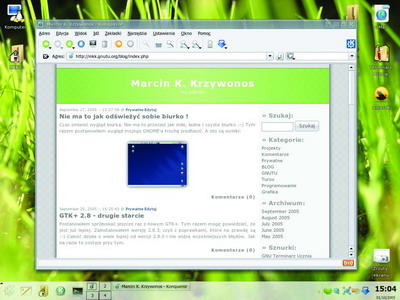
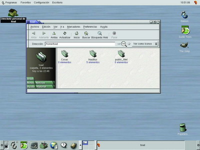
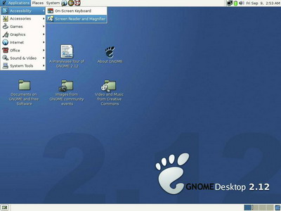

## GNOME获得商业公司的支持

进入2004年后，KDE与GNOME依然保持快速发展，KDE阵营分别在2月份和8月份推出3.2、3.3版本，GNOME则在3月和9月推出2.6和
2.8，两者的版本升级步幅旗鼓相当。到3.3版本的KDE已经非常成熟，它拥有包括KOffice、Konqueror浏览器、Kmail套件、KDE
即时消息在内的一大堆应用软件，且多数都达到可用标准，功能上完全不亚于Windows
2000。而GNOME更是在此期间高速发展，GNOME2.8版本的水准完全不逊于KDE3.3，而且此时两者的技术特点非常鲜明：GNOME讲究简单、高效，运行速度比KDE更快；KDE则拥有华丽的界面和丰富的功能，使用习惯也与微软Windows较类似。商业支持方面，RedHat还是
GNOME的铁杆支持者，IBM、SUN、Novell、HP等重量级企业也都选择GNOME，而KDE的主要支持者暂时为SuSE、Mandrake以及中科红旗、共创开源在内的国内发行商。2005年，厚积薄发的GNOME开始全面反超，3月份的2.10、9月份的2.12让GNOME获得近乎脱胎换骨的变化，加之OpenOffice.org
2.0、Firefox1.5等重磅软件的出台让GNOME如虎添翼；KDE方面则分别在3月和11月推出3.4和3.5，其中KDE3.5也逼近完美境地，我们认为它的水平与GNOME2.12不相伯仲。但KDE在商业支持方面每况愈下，Novell在11月宣布旗下所有的商业性发行版将使用GNOME
作为默认桌面（仍会对KDELibraries提供支持），SuSELinux桌面版则会对KDE与GNOME提供同等支持，而社区支持的
OpenSuSE仍将使用KDE体系—但谁都明白GNOME将成为Novell的重心，KDE只是活跃在免费的自由发行版中。

**图 49.6. KDE3.5可实现半透明和阴影效果，界面华丽、软件丰富。**

到这里，我们发现一个颇富戏剧性的结局：致力于商业化的KDE反而失去了重量级商业企业的支持，尽管一些中小规模的Linux企业因技术能力问题将继续支持KDE，但它的商业前途有限。而遵循GPL、完全不以商业化为目的的GNOME反而在该领域大获成功。许多Linux发烧友都不明白为什么优秀的KDE
会受到如此待遇，其实道理非常简单—没有哪一家重量级企业喜欢受制于人，也许KDE的Qt不需要很多授权费，但谁知道TrollTech公司以后会不会漫天要价？既然有免费的GNOME可以选择，那为什么不呢？基于此种理由，RedHat、Novell两家最大的Linux企业和SUN都采用GNOME，而它们对GNOME的鼎力支持也让该项目可拥有足够多的技术保证，为今后的高速发展奠定坚实的基础。需要纠正一个可能的误解，虽然Novell收购了
Ximian，但RedHat并没有受到太大影响，双方对GNOME的贡献都是相互共享的，因为GNOME以GPL自由版权公约发行，合作即共赢。至于
KDE项目，虽然它失去这些商业巨头的支持，但没有能力转换桌面的中小Linux厂商将继续追随KDE，而且在非商业的社区Linux发行版中，KDE依然有强大的生命力。

**图 49.7. GNOME 1.4解决了稳定性问题，功能初步完善**

虽然在商业方面存在竞争，GNOME与KDE两大阵营的开发者关系并没有变得更糟，相反他们都意识到支持对方的重要性。如果KDE和GNOME无法实现应用程序的共享，那不仅是巨大的资源浪费，而且将导致Linux出现根本上的分裂。事实上，无论是GNOME的开发者还是KDE的开发者，他们都有着共同的目标，就是为Linux开发最好的图形环境，只是因为理念之差而分属不同的阵营。KDE与GNOME的商业竞争对开发者们其实没有任何利益影响（只有
TrollTech会受影响），基于共同的目的，KDE与GNOME阵营大约从2003年开始逐渐相互支持对方的程序—只要你在KDE环境中安装GTK
库，便可以运行GNOME的程序，反之亦然。经过两年多的努力，KDE和GNOME都已经实现高度的互操作性，两大平台的程序都是完全共享的，例如你可以在GNOME中运行Konqueror浏览器、Koffice套件，也可以在KDE中运行Evolution和OpenOffice.org，只不过执行本地程序的速度和视觉效果会好一些。在未来一两年内，KDE和GNOME将进行更高等级的融合，但两者大概永远都不会合为一体—GNOME还是
GNOME，KDE也还是KDE。或许你觉得这是浪费开发资源而且很可能让用户无从选择，但我们告诉你这就是Linux，它与Windows和
MacOSX有着绝然不同的文化。更何况全球有越来越多自由软件开发者（所以不必担心浪费开发资源），Linux用户的使用偏好也不可能总是相同，保持两个并行发展的图形环境项目没有什么不妥。至于GNOME项目和KDE项目的开发者们，曾经因为理念不同而吵得天翻地覆，但他们现在尽释前嫌，因为所有人都意识到，他们其实彼此需要，团结在一起可以让他们在硬件厂商面前有更大的发言权，从而促使厂商在推出Windows驱动的同时也提供相应的Linux版本，而且彼此可以相互借鉴优秀的设计，确保Linux拥有一个最出色的图形桌面环境。

**图 49.8. GNOME 2.12保持惯有的简洁和高效**

